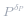
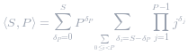

#### 方法 1：动态规划

**想法**

令 `dp[i][j]` 为播放列表长度为 `i` 包含恰好 `j` 首不同歌曲的数量。我们需要计算 `dp[L][N]`，看上去可以通过 `dp` 来解决。

**算法**

考虑 `dp[i][j]`。最后一首歌，我们可以播放没有播放过的歌也可以是播放过的。如果未播放过的，那么就是 `dp[i-1][j-1] * (N-j)` 种选择方法。如果不是，那么就是选择之前的一首歌，`dp[i-1][j] * max(j-K, 0)`（`j` 首歌，最近的 `K` 首不可以播放）。

```Java []
class Solution {
    public int numMusicPlaylists(int N, int L, int K) {
        int MOD = 1_000_000_007;

        long[][] dp = new long[L+1][N+1];
        dp[0][0] = 1;
        for (int i = 1; i <= L; ++i)
            for (int j = 1; j <= N; ++j) {
                dp[i][j] += dp[i-1][j-1] * (N-j+1);
                dp[i][j] += dp[i-1][j] * Math.max(j-K, 0);
                dp[i][j] %= MOD;
            }

        return (int) dp[L][N];
    }
}
```

```Python []
from functools import lru_cache

class Solution:
    def numMusicPlaylists(self, N, L, K):
        @lru_cache(None)
        def dp(i, j):
            if i == 0:
                return +(j == 0)
            ans = dp(i-1, j-1) * (N-j+1)
            ans += dp(i-1, j) * max(j-K, 0)
            return ans % (10**9+7)

        return dp(L, N)
```

**复杂度分析**

* 时间复杂度：*O(NL)*。
* 空间复杂度：*O(NL)*。（然而，我们可以只存储最后一列的 `dp` 数组来优化空间，这样只需要 *O(L)* 的空间复杂度。）


#### 方法 2：分类 + 动态规划

（注意：这个方法相当具有挑战性，但是在模拟这种列表时是一个常见的结论）

**想法**

由于我们只关心播放次数至少一次的歌，我们记录每首歌第一次播放的时刻  。例如，我们有 5 首歌 `abcde`，播放列表为 `abacabdcbaeacbd`，那么 *x = (1, 2, 4, 7, 11)* 就是第一首歌出现的时刻。方便起见，我们让 *x_{N+1} = L+1*。我们的策略就是计算满足 *x* 的播放列表个数  ，最后结果是  。

直接计算，

 

 

令  ，所以  。所以最后结果是（*S = L-N, P = N-K+1*）：

 

方便起见,将这个结果记录为  。

**算法**

我们可以通过数学方法迭代计算   的值，通过提出因子  。

 

 

所以可以写成代数形式：

 

通过这个迭代，我们可以通过类似方法 1 使用动态规划算法。最后的结果是  。

```Java []
class Solution {
    public int numMusicPlaylists(int N, int L, int K) {
        int MOD = 1_000_000_007;

        // dp[S] at time P = <S, P> as discussed in article
        long[] dp = new long[L-N+1];
        Arrays.fill(dp, 1);
        for (int p = 2; p <= N-K; ++p)
            for (int i = 1; i <= L-N; ++i) {
                dp[i] += dp[i-1] * p;
                dp[i] %= MOD;
            }

        // Multiply by N!
        long ans = dp[L-N];
        for (int k = 2; k <= N; ++k)
            ans = ans * k % MOD;
        return (int) ans;
    }
}
```

```Python []
class Solution(object):
    def numMusicPlaylists(self, N, L, K):
        # dp[S] at time P = <S, P> as discussed in article
        dp = [1] * (L-N+1)
        for p in xrange(2, N-K+1):
            for i in xrange(1, L-N+1):
                dp[i] += dp[i-1] * p

        # Multiply by N!
        ans = dp[-1]
        for k in xrange(2, N+1):
            ans *= k
        return ans % (10**9 + 7)
```

**复杂度分析**

* 时间复杂度：*O(NL)*。
* 空间复杂度：*O(L)*。

#### 方法 3：生成函数

（注意：这个解法非常难，同时不推荐在面试中使用，但为了题解的完整性实现于此。）

**分析**

按照方法 2 的术语，我们希望快速计算  。我们使用生成函数。

对于一个固定的 *P*，考虑函数：

 
 

 

*f* 中 *x^S* 的系数（记为 *[x^S]f*）就是  。

根据中国剩余定理，这个乘积可以写成一个部分分数的形式：

 

对于一些有理系数 *A_k*。我们也可以通过清除分母并对   设 *x = 1/m*，根据每个给定的 *m*，所有的元素项除了第 *m* 项会消失，有：

 

由于  ，所以合在一起有：

![\[x^S\]f=\sum_{k=1}^PA_k*k^S ](./p____x^S_f_=_sum_{k=1}^P_A_k_*_k^S__.png) 

所以最终结果为

 

 

我们只需要一个快速的方法计算  ，事实上，

 

所以我们就有了所有计算的表达式。


```Python []
class Solution(object):
    def numMusicPlaylists(self, N, L, K):
        MOD = 10**9 + 7
        def inv(x):
            return pow(x, MOD-2, MOD)

        C = 1
        for x in xrange(1, N-K):
            C *= -x
            C %= MOD
        C = inv(C)

        ans = 0
        for k in xrange(1, N-K+1):
            ans += pow(k, L-K-1, MOD) * C
            C = C * (k - (N-K)) % MOD * inv(k) % MOD

        for k in xrange(1, N+1):
            ans = ans * k % MOD
        return ans
```

**复杂度分析**

* 时间复杂度： 。
* 空间复杂度：*O(1)*。