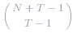
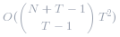

####  方法一：优化穷举搜索 
答案是彻底搜索贴纸的组合。因为数据是随机化的，所以有很多启发式方法可以帮助我们更快地实现这一目标。 
- 对于所有的贴纸，我们可以忽略目标单词中没有的任何字母。
-  当我们的候选答案不会小于我们已经找到的答案时，我们可以停止搜索此路径。 
- 我们应该尽量让我们的详尽搜索尽快绑定到答案，因此上面描述的效果会更频繁的发生。 
- 当一个贴纸占主导地位时，我们不应该将被主导地位的贴纸纳入我们的贴纸收藏中。[这里我们说，如果 `A.count(letter) >= B.count(letter)` ,`letter` 代表所有字母，则贴纸 `A` 占 `B` 的主导地位。] 

**算法：**
- 首先，对于每个贴纸，让我们创建一个哈希表存储贴纸中的含有目标单词中的字母计数（mapping `letter -> sticker.count(letter)`）。`A` 是记录贴纸中含有目标单词字母数量的数组。另外，让我们创建 `t_count`，记录目标单词的字母数量。 
- 其次，让我们去掉被主导的贴纸。我们只需要检查一次贴纸是否由其他贴纸主导，那些不被主导的贴纸包含在我们的收藏中。 
- 我们现在准备开始彻底搜查。调用 `search(ans)` 表示我们要确定可以在 `A` 中使用的最小贴纸数，以满足目标计数 `t_count`。`ans` 将存储当前形成的答案，`best` 将存储当前最佳答案。 
- 如果我们当前的答案不能超过当前的最佳答案，我们应该停止搜索。若我们的目标是满意的，我们应该更新我们的答案。 
- 否则，我们想知道我们可以使用的这个贴纸的最大数量。例如，如果这个标签是 `'abb'`，我们的目标是 `'aaabbbbccccc'`，那么我们最多可以使用 3 个贴纸。这是 `math.ceil(target.count(letter) / sticker.count(letter))` 的最大值，它接管了 `sticker` 中的所有字母。我们称之为 `used`。 
- 之后，对于我们目前正在考虑的贴纸，我们尝试 `used` 它们，然后 `used - 1`，`used - 2` 等等。我们这样做的原因是为了更快地获得最佳值，这将阻止我们穷尽搜索的其他分支继续进行。 

**复杂度分析**

* 时间复杂度：*N* 作为贴纸的数目，*T* 作为目标单词的字母数目。时间复杂度的界限是 *O(N^{T+1} T^2)*：对于每个贴纸，我们必须尝试使用它最多 *T+1* 次，并更新我们的目标计数成本 *O(T)*，我们最多做 *T* 次。或者，由于答案的范围是 *T* 的，我们可以证明我们最多只能搜索   次。这将是  。
* 空间复杂度：*O(N+T)*，在调用 `search` 时存储 `stickersCount`、`targetcount` 并处理递归调用堆栈。

####  方法二：动态规划
对于每一个状态，我们现在就来处理它，看看在应用一个贴纸之后会发生什么。对于贴纸中可以满足字母的状态的位，我们设置 `state`（`now |= 1 << i`）。最后，我们知道现在是将该贴纸应用到贴纸的结果，并且我们适当地更新了我们的 `dp`。

**复杂度分析**

* 时间复杂度：*O(2^T * S * T)* 其中 *S* 是所有贴纸中的字母总数，*T* 是目标单词中的字母数。我们可以仔细检查每个循环，得出这个结论。 
* 空间复杂度：*O(2^T)*，`dp` 使用的空间。